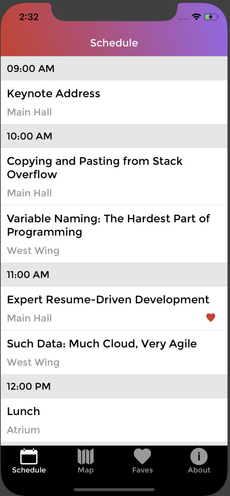
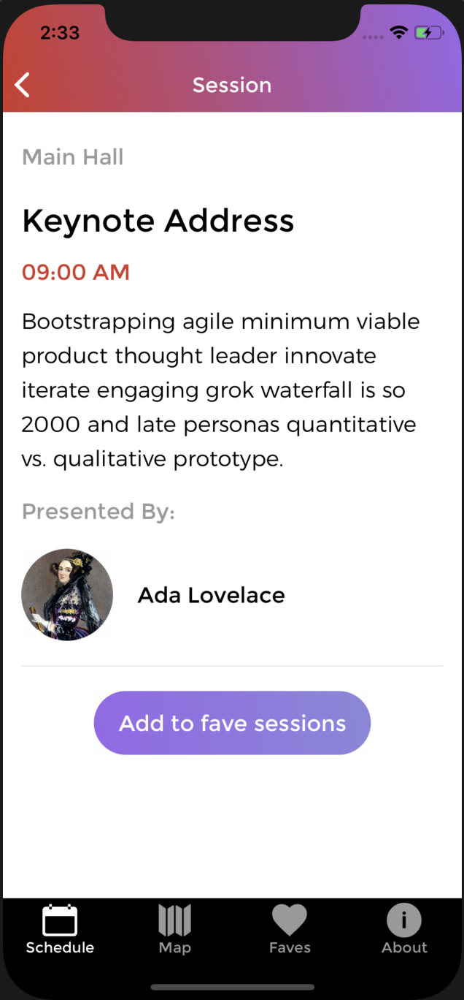
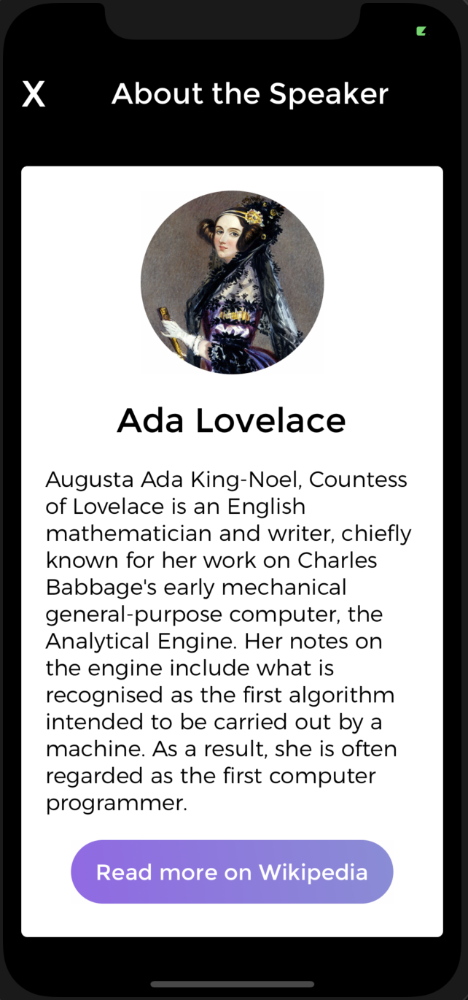
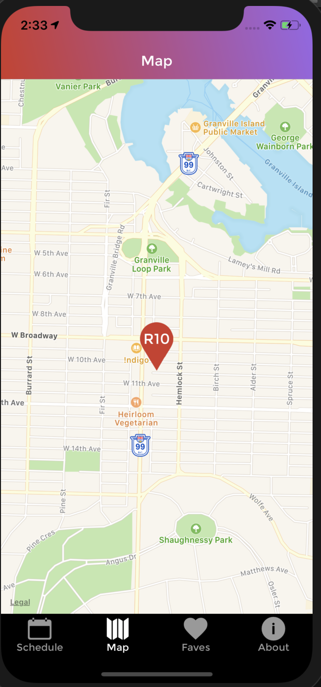
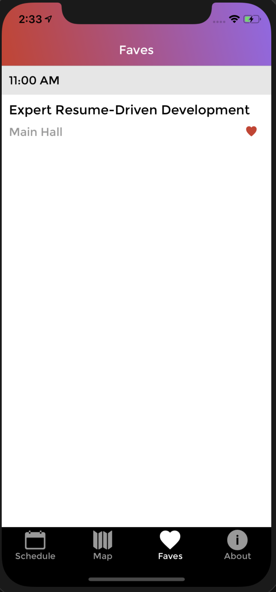
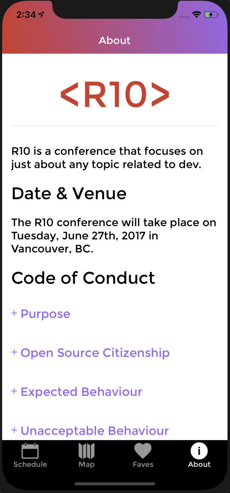

# R10 📱

R10 is a mobile project based on a 1 day tech conference. It uses React Native to create app that runs on both android and ios, with data provided by an api using GraphQl.

## Technologies and frameworks used

React Native
xCode
Android Studio
GraphQl
Apollo Client
React Navigation
React Native Maps
React Vector icons

## Installation and running the app

### IOS

To run the app on ios emulator, make sure to have downloaded the latest stable release of xCode (10.3), shell into the project root directory and run:

`react-native run-ios`

### Android

To run on android download the latest release of Java from the Oracle home website, and Android Studio. In android studio make sure to download the correct SDKs to allow you to create a virtual device running Pie 9.0 android software, which is required by react native.
When the virtual device is started, shell into the project root directory and run :

`react-native run-android`

### Android Map

To aces the google maps api on android you will need to add a Maps for Android SDK api key to the `android:value` property at `/android/app/src/main/AndroidManifest.xml` under the `meta-data` tag

## Screenshots

### Schedule

### Single Session

### Speaker

### Map

### Faves

### About

## Author

Oliver Wright
[GitHub](https://github.com/oliwright1994)
